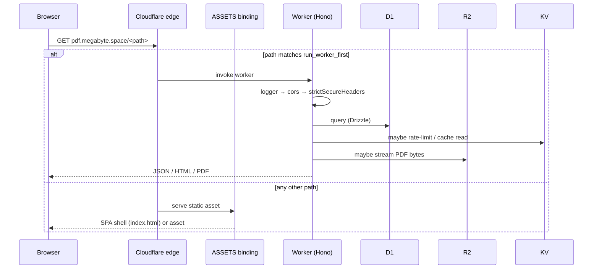
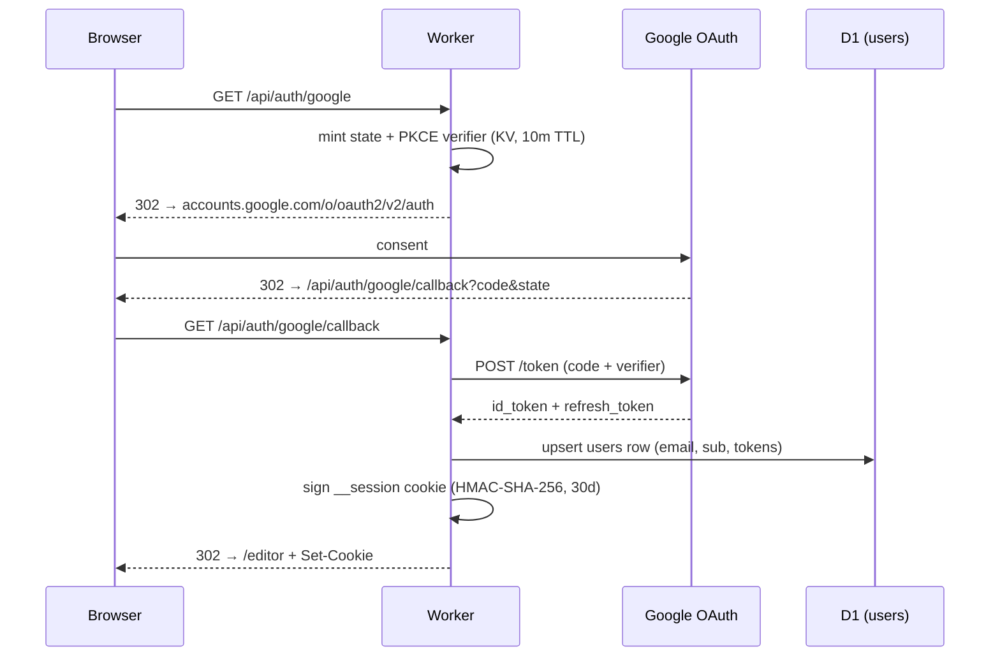
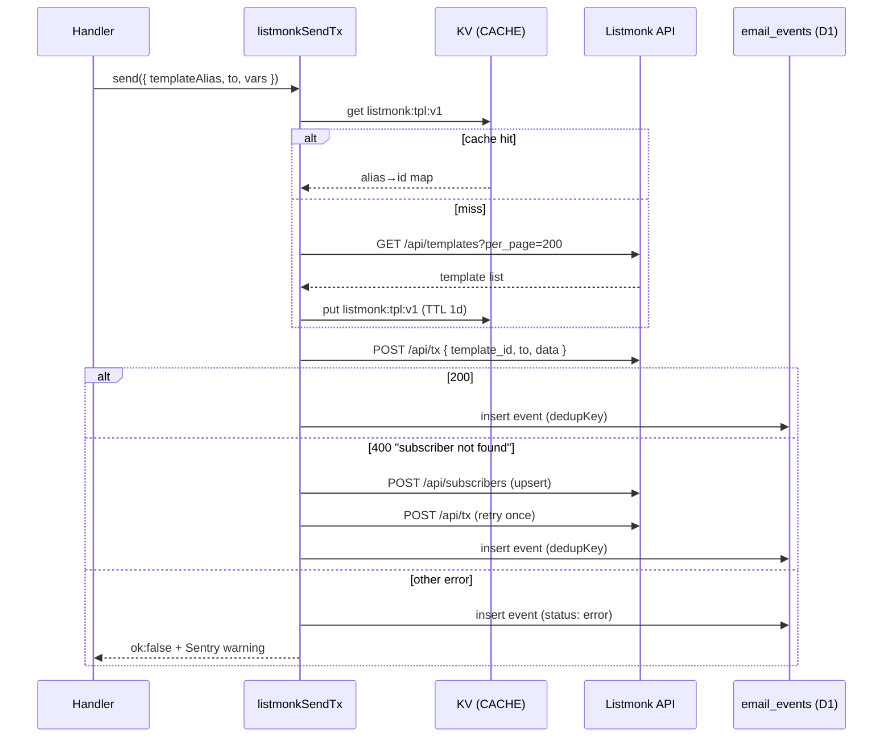

# Architecture

This document describes how Megabyte PDF is put together: the request lifecycle, the persistence model, the Worker route map, the asset-routing trick, and the email pipeline.

## Topology

```
                       ┌──────────────────────────────────────┐
                       │   pdf.megabyte.space (custom domain) │
                       └──────────────────────────────────────┘
                                       │
                                       ▼
                       ┌──────────────────────────────────────┐
   run_worker_first ──►│         Cloudflare Worker            │
   matched first       │  src/worker/index.ts (Hono root)     │
                       └──────────────────────────────────────┘
                                       │
       ┌───────────────────────────────┼────────────────────────────────┐
       │                               │                                │
       ▼                               ▼                                ▼
  ┌────────────┐               ┌──────────────┐                  ┌────────────┐
  │  D1: DB    │               │  KV: CACHE   │                  │  R2: PDFS  │
  │ (Drizzle)  │               │  rate-limit, │                  │ exports +  │
  │            │               │  template id │                  │ thumbnails │
  └────────────┘               └──────────────┘                  └────────────┘
                                       │
                                       ▼
                          ┌──────────────────────────┐
                          │  Browser binding         │
                          │  (@cloudflare/puppeteer) │
                          │  → PDF render            │
                          └──────────────────────────┘
                                       │
                                       ▼
                          ┌──────────────────────────┐
                          │ External services:       │
                          │  Anthropic (Claude)      │
                          │  Listmonk (email)        │
                          │  Stripe (billing)        │
                          │  Sentry / PostHog / GTM  │
                          └──────────────────────────┘

   Everything else (SPA HTML, JS, CSS, fonts, images) is served by the
   ASSETS binding (Cloudflare Assets) — never touches the Worker.
```

## Request flow (Mermaid)



## Request lifecycle

1. Cloudflare edge receives a request for `pdf.megabyte.space/*`.
2. The Worker is invoked **only when** the URL matches a prefix in `[assets].run_worker_first` — currently `/api/*`, `/s/*`, `/og/*`, `/podcast/*`, `/sitemap.xml`, `/feed.xml`, `/feed.json`. Other paths skip the Worker and go straight to Assets.
3. Inside the Worker, Hono runs the global middleware chain:
   - `hono/logger` (structured request log)
   - `cors` (scoped to `/api/*` with allow-list of `APP_URL`, prod hostname, localhost)
   - `strictSecureHeaders` — CSP + HSTS + frame/referrer policy, **bypassed** for `/api/public/:slug/render` and `/s/:slug/render` (those endpoints set their own scoped CSP because they host arbitrary user HTML).
4. The router dispatches to a sub-app under `src/worker/routes/*.ts` or to one of the inline `/api/health`, `/api/config`, `/api/me`, `/api/admin/plan`, `/sitemap.xml`, `/feed.xml`, `/feed.json` handlers in `src/worker/index.ts`.
5. Uncaught errors bubble to `app.onError()` which logs to Sentry with `{ route, method, url, userId }` tags and returns the standard error envelope `{ error, code }`.
6. `app.notFound()` returns JSON 404 for `/api/*`, `/s/*`, `/og/*`, and falls back to the SPA shell (via `env.ASSETS.fetch(...)`) for everything else.

## Sub-apps

Each route file under `src/worker/routes/` exports a Hono sub-app mounted in `index.ts`:

| File                | Mount                      | Notes                                                                |
| ------------------- | -------------------------- | -------------------------------------------------------------------- |
| `auth.ts`           | `/api/auth`                | Google OAuth flow + signed cookie sessions                            |
| `projects.ts`       | `/api/projects`            | CRUD for documents; soft-delete via `deletedAt`                       |
| `chat.ts`           | `/api`                     | Editor chat turns → Claude → diff/patch back into project HTML/CSS    |
| `assistant.ts`      | `/api/assistant`           | Standalone assistant endpoint (one-shot)                              |
| `export.ts`         | `/api`                     | PDF export via Browser binding, persisted to R2                       |
| `share.ts`          | `/api` (shareApi) + `/s`   | Slug-based public preview; split into private API + public sub-app    |
| `explore.ts`        | `/api/explore`             | Trending feed + search                                                 |
| `billing.ts`        | `/api/billing`             | Stripe checkout + portal + webhook                                     |
| `guest.ts`          | `/api/guest`               | Anonymous-user flow (try-before-signin)                                |
| `follows.ts`        | `/api/follows`             | Follow / unfollow another creator                                      |
| `email.ts`          | `/api/email`               | Preference center + one-click unsubscribe                              |
| `podcast.ts`        | `/api/podcast` + `/podcast`| Subscribe endpoint + public RSS feed (`podcastPublic` sub-app)         |
| `newsletter.ts`     | `/api/newsletter`          | Product-newsletter subscribe                                            |
| `og-template.ts`    | `/og`                      | Dynamic 1200×630 OG-card SVG/PNG per project                            |

Two are intentionally split into private + public sub-apps:

- **share.ts** exports `shareApi` (auth-required CRUD on share links, mounted at `/api`) and `sharePublic` (token-validated GET at `/s/:slug`).
- **podcast.ts** exports the default app (`/api/podcast/subscribe`) and a named `podcastPublic` export (`/podcast/feed.xml`). The split exists because `/podcast/*` must be in `run_worker_first` to beat the Assets SPA fallback, and we don't want to put `/api/podcast` (already covered by `/api/*`) twice.

## Why `run_worker_first` exists

Cloudflare Assets are evaluated against `dist/` *before* the Worker runs, unless a prefix is listed in `[assets].run_worker_first`. The SPA fallback (`not_found_handling = "single-page-application"`) means an unmatched path serves `index.html` — perfect for client routes like `/dashboard`, `/editor/:id`, `/c/:slug`, but catastrophic for server-rendered endpoints like RSS feeds and OG images.

The deployed list is:

```toml
run_worker_first = ["/api/*", "/s/*", "/og/*", "/podcast/*", "/sitemap.xml", "/feed.xml", "/feed.json"]
```

Reference incident (2026-05-12): a first deploy of `/podcast/feed.xml` returned `text/html` because `/podcast/*` was missing from the list. Assets matched `/podcast/feed.xml` against the SPA fallback before the Worker ever saw it. Fix: add `/podcast/*` and redeploy.

When adding any new server-rendered endpoint, add its prefix to `run_worker_first` in the same PR.

## Database schema

Drizzle schema lives in `src/worker/db/schema.ts`. The full table list:

| Table                | Purpose                                                                  |
| -------------------- | ------------------------------------------------------------------------ |
| `users`              | OAuth identity, plan, Stripe customer/sub, email prefs JSON, unsub token |
| `sessions`           | Signed-cookie session rows with TTL                                       |
| `projects`           | Document HTML+CSS+metadata; soft-deleted via `deletedAt`                  |
| `turns`              | Chat history per project (role, content, token counts, snapshot ref)      |
| `snapshots`          | Point-in-time HTML+CSS for undo / share-link freeze                       |
| `share_links`        | Slug → snapshot + view counter + optional expiry                          |
| `exports`            | R2 keys for generated PDF blobs + size                                    |
| `email_events`       | Per-template dedupe key + status + provider id                            |
| `project_milestones` | Achievement unlocks (first export, first share, etc.)                     |
| `follows`            | Directed graph of creator follows                                          |

Conventions:

- All ids are text (UUIDv4 or nanoid).
- All timestamps are `timestamp_ms` integer columns with `default unixepoch()*1000`.
- `users.email` and `users.googleSub` are uniquely indexed.
- `projects.slug` is unique; `(userId, deletedAt)` and `(isPublic, updatedAt)` are indexed for the common queries.
- `turns.(projectId, createdAt)` indexed for chat-history scrolling.
- `email_events.dedupKey` is uniquely indexed — this is the idempotency mechanism for cron-driven sends.

Migrations live in `drizzle/*.sql`. Generate new ones with `npm run db:generate`, apply with `npm run db:apply:local` / `:prod`. D1 has **no transactions** — use `db.batch([...])` for multi-statement work.

## CSP strategy

Two CSP modes coexist:

### Global strict CSP (default)

Applied via `hono/secure-headers` in `src/worker/index.ts` to every non-render path. Allow-listed origins:

- **scripts**: GTM, Stripe, Turnstile, PostHog, Cloudflare Insights, plus `'self'` + `'unsafe-inline'` (Vite build emits inline scripts in the SPA bundle).
- **connect**: Sentry (`*.sentry.io`, `sentry.megabyte.space`), PostHog, GA4 regional ingest, GTM, Stripe API, Google OAuth, Cloudflare Insights.
- **img**: `'self'` + `data:` + GTM/GA + Google profile photos (`lh3.googleusercontent.com`).
- **frame**: `'self'` + GTM + Stripe + Turnstile + Google OAuth.
- **font**: `'self'` + Google Fonts.
- **style**: `'self'` + `'unsafe-inline'` + Google Fonts CSS.
- **report-uri**: Sentry security-events endpoint.

### Scoped permissive CSP (PDF render endpoints)

`/api/public/:slug/render` and `/s/:slug/render` host arbitrary user HTML/CSS/images. The global CSP would block legitimate user content (any `https://` image they include). These endpoints set their own scoped CSP in-handler:

```
default-src 'self';
script-src 'self' 'unsafe-inline';
style-src 'self' 'unsafe-inline' https://fonts.googleapis.com;
font-src 'self' data: https://fonts.gstatic.com;
img-src 'self' data: blob: https:;     # ← permissive for any HTTPS image
connect-src 'none';                     # ← no fetches from rendered docs
frame-ancestors 'self';
base-uri 'none';
```

`connect-src 'none'` + `base-uri 'none'` defang XSS even if a user pastes hostile HTML; rendered docs can show images and styled type but can't talk back.

The parent SPA CSP must include `frame-src 'self'` so the editor + public `/c/<slug>` page can iframe these endpoints (incident: 2026-05-11 — community PDF iframes appeared as broken-doc icons until `frame-src 'self'` was added).

## Auth flow (Mermaid)



## Email pipeline

Listmonk is the system of record. The integration sits at `src/worker/lib/listmonk.ts`.

### Transactional sends

Listmonk's `/api/tx` requires a numeric template id, but we want to call templates by alias in code (`welcome`, `newsletter_welcome`, `podcast_confirm`). The client resolves alias → id through a KV-cached map:

```
KV key:  listmonk:tpl:v1
TTL:     86400 (1 day)
Shape:   { "welcome": 1, "newsletter_welcome": 2, ... }
```

On a cache miss the client fetches `/api/templates?per_page=200`, filters `type === "tx"`, builds the map, and writes it back. On a per-alias miss (template was added since the map was built) it invalidates and refetches once.

When Listmonk returns `400 "Subscriber not found"` for a transactional send, the client upserts the subscriber and retries once. This makes welcome flows resilient to a brand-new email never having been imported.

### Transactional flow (Mermaid)



### Broadcast / cron-driven sends

Schedule lives in `wrangler.toml`:

```toml
[triggers]
crons = [
  "0 14 * * *",     # 14:00 UTC daily — abandoned-prompt + share-expiring + annual-summary + onboard-day3-stuck
  "0 15 * * 6",     # Saturday 15:00 UTC — weekly-digest
  "0 13 * * 1",     # Monday 13:00 UTC — template-of-week
  "30 14 * * *",    # 14:30 UTC daily — win-back-30d + ai-boost
  "0 14 * * 3",     # Wednesday 14:00 UTC — tip-of-the-week
  "0 16 1 1,4,7,10 *" # Quarterly 16:00 UTC on the 1st — privacy-report
]
```

The `scheduled()` export in `src/worker/index.ts` calls `runCron(env, controller)` which reads candidates from D1, dispatches via Listmonk, and writes to `email_events` with a `dedupKey` to guarantee idempotency on cron-overlap or retry.

### Template lifecycle

1. Edit / add `emails/<NN>-<name>.html` (uses `_base.html` + `_layout.html` partials).
2. Run `scripts/listmonk-sync.mjs` to push to Listmonk.
3. Bust the KV cache if the alias is new: `wrangler kv key delete --binding=CACHE "listmonk:tpl:v1"`.

## PDF rendering

The Browser binding (`BROWSER` in `wrangler.toml`) gives the Worker access to a headless Chromium pool. `@cloudflare/puppeteer` is the client. The render flow:

1. Build a wrapper HTML document via `wrapDocument(html, css, pageSize, margin)` (or `buildSharePreviewDoc` for iframe previews).
2. `puppeteer.launch(env.BROWSER)` → `browser.newPage()`.
3. `page.setContent(html, { waitUntil: "networkidle0" })`.
4. `page.pdf({ format: pageSize, margin: pageDimensionsIn(margin) })`.
5. Persist bytes to R2 under `pdfs/<projectId>/<exportId>.pdf` and record the export row in D1.

PDF render is **synchronous within the request** because total time stays well under the Worker CPU budget. If render time creeps up we'd offload to a Queue + background worker.

## Frontend

`src/web/main.tsx` is the app root. React Router 7 owns navigation. Tailwind 4 ships brand tokens via `src/web/styles.css`. The editor (`src/web/pages/Editor.tsx`) hosts the WYSIWYG canvas + CodeMirror panel + AI chat drawer (`src/web/components/AiAssistantDrawer.tsx`).

Vite's manual-chunk strategy (in `vite.config.ts`) splits CodeMirror core/lang/theme, React, and icons into separate chunks so the Landing route doesn't pay the editor cost. The Vite proxy forwards `/api/*` and `/s/*` to `localhost:8787` (Wrangler dev).

## Observability

- **Sentry** wraps the whole Worker via `Sentry.withSentry(...)` in `src/worker/index.ts`. Browser SDK is initialised in `src/web/main.tsx` using `SENTRY_DSN_CLIENT` from `/api/config`.
- **PostHog** is loaded in the SPA when `POSTHOG_API_KEY` is present in `/api/config`.
- **GTM / GA4** load via `GTM_CONTAINER_ID` if configured.

Every Worker handler that does interesting work either captures exceptions explicitly (`Sentry.captureException`) or adds a breadcrumb (`Sentry.addBreadcrumb`) before fire-and-forget operations.
